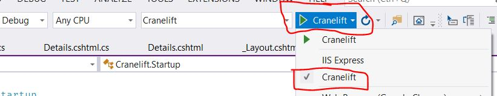

# Cranelift
The background job processing controller for ZhirOCR.


## How to run

1. Open `Cranelift.sln` in Visual Studio 2019
2. Paste this in `secrets.json`:

```json
{
  "ConnectionStrings": {
    "HangfireConnection": "Server=localhost;Database=zhir-hangfire;Uid=***;Pwd=***;Allow User Variables=True;CharSet=utf8;",
    "OcrConnection": "Server=localhost;Database=zhir-ocr;Uid=***;Pwd=***;CharSet=utf8;"
  },
  "Users": [
    {
      "Username": "muhammad",
      "Password": "***"
    },
    {
      "Username": "aram",
      "Password": "***"
    }
  ],
  "Storage": {
    "HostName": "https://ewr1.vultrobjects.com",
    "AccessKey": "***",
    "Secret": "***",
    "BucketName": "zhir-ocr"
  },
  "Email": {
    "FromAddress": "zhir.company.io@gmail.com",
    "Password": "***",
    "Host": "smtp.gmail.com",
    "Port": 587
  },
  "FastPay": {
  "Password": "******",
  "DeviceId": "****",
  "AppId": "***",
  "Number": "+9647507665935",
  "IntervalMinMinutes": 10,
  "IntervalMaxMinutes": 40
  },
  "Sentry": {
    "Dsn": "https://*****.ingest.sentry.io/*****",
    "IncludeRequestPayload": true,
    "SendDefaultPii": true,
    "MinimumBreadcrumbLevel": "Debug",
    "MinimumEventLevel": "Warning",
    "AttachStackTrace": true,
    "Debug": false,
    "DiagnosticsLevel": "Error"
  }
}
```

**Note:** User password is plaintext.

3. Change the configuration in `secrets.json` to connect to development database and object storage.

4. Create an empty database for Hangfire called `zhir-hangfire`.

5. In Visual Studio 2019, use Kestrel to run Cranelift:
   

6. In Visual Studio 2019 press CTRL + F5 to run Cranelift

7. Browse to https://localhost:5001/

## Dependencies

### Ubuntu 20.04 LTS
While Zhir OCR is cross-platform, we have only tested it on Ubuntu 20.04. 

### Python3
```
sudo apt install python3-pip
```

### Zhirpy Dependencies
```
pip3 install -r Dependencies/zhirpy/requirements.txt
```

### Tesseract 5-alpha or better

```
sudo add-apt-repository ppa:alex-p/tesseract-ocr-devel
sudo apt-get update
sudo apt install tesseract-ocr
```

Read more about [installing Tesseract here](https://tesseract-ocr.github.io/tessdoc/#500x).
