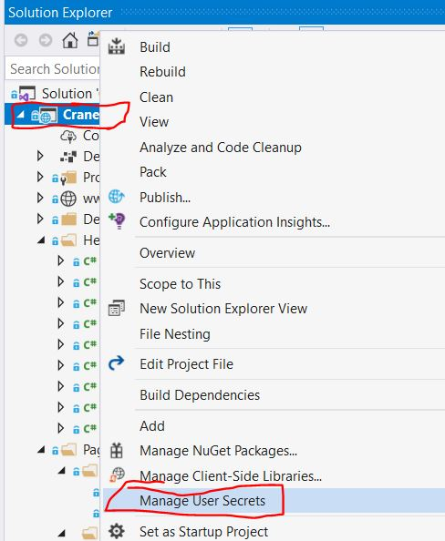

# Cranelift
The background job processing controller for ZhirOCR.

## How to run

1. Open `Cranelift.sln` in Visual Studio 2019
2. Right Click on `Cranelift` project in Solution Explorer and Click on `Manage User Secrets`. This will open `secrets.json`.
   

3. Paste this in `secrets.json`:

```json
{
  "ConnectionStrings": {
    "HangfireConnection": "Server=localhost;Database=zhir-hangfire;Uid=***;Pwd=***;Allow User Variables=True;CharSet=utf8;",
    "OcrConnection": "Server=localhost;Database=zhir-ocr;Uid=***;Pwd=***;CharSet=utf8;"
  },
  "Users": [
    {
      "Username": "muhammad",
      "Password": "***"
    },
    {
      "Username": "aram",
      "Password": "***"
    }
  ],
  "Storage": {
    "HostName": "https://ewr1.vultrobjects.com",
    "AccessKey": "***",
    "Secret": "***",
    "BucketName": "zhir-ocr"
  },
  "Email": {
    "FromAddress": "zhir.company.io@gmail.com",
    "Password": "***",
    "Host": "smtp.gmail.com",
    "Port": 587
  },
  "FastPay": {
  "Token": "***",
  "Number": "+9647507665935",
  "IntervalMinMinutes": 10,
  "IntervalMaxMinutes": 40
  },
  "Sentry": {
    "Dsn": "https://*****.ingest.sentry.io/*****",
    "IncludeRequestPayload": true,
    "SendDefaultPii": true,
    "MinimumBreadcrumbLevel": "Debug",
    "MinimumEventLevel": "Warning",
    "AttachStackTrace": true,
    "Debug": false,
    "DiagnosticsLevel": "Error"
  }
}
```

**Note:** User password is plaintext.

4. Change the configuration in `secrets.json` to connect to development database and object storage.

5. Create an empty database for Hangfire called `zhir-hangfire`.

6. In Visual Studio 2019, use Kestrel to run Cranelift:
   

7. In Visual Studio 2019 press CTRL + F5 to run Cranelift

8. Browse to https://localhost:5001/
